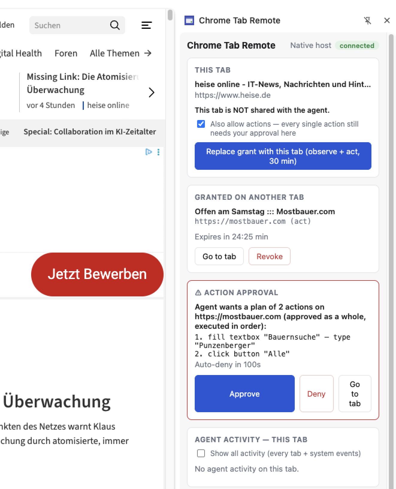

# Chrome Tab Remote

**Let an AI agent see exactly one browser tab — the one you chose, for as long as you allow, and nothing else.**

## Why this exists

AI agents are getting good at working with web pages, but today's options force an ugly trade: either the agent drives its own separate robot browser (no access to your real, logged-in world), or you install something with frightening powers over *every* tab you have open.

Chrome Tab Remote takes a third path, built on one conviction: **trust is the product.** You point at a single tab and say "this one". The agent can then read that tab — and only that tab — until the grant expires, the tab navigates somewhere else, or you hit Revoke. Everything the agent does is written to an audit trail you can inspect.

The goal is an extension so small, so boring, and so reviewable that a security-conscious company could actually approve it. No tracking, no data collection, no cloud service, no AI inside the extension — just a strict, visible consent boundary between your browser and whatever agent you connect.

## What it does (and refuses to do)

- **You grant, it observes.** One click in the side panel grants read access to the current tab for 30 minutes. Chrome itself asks for your confirmation for that one website — never "all sites".
- **The grant is pinned.** If the tab navigates to a different website, access is automatically suspended until you explicitly re-confirm — the panel shows you exactly which site you'd be re-approving.
- **Revocation is instant.** One click, or just close the tab. Expiry is automatic.
- **Observe by default; acting needs double consent.** A normal grant is read-only. Only if you tick **"allow actions"** when granting may the agent click, fill, or select — and even then **every single action pauses in the side panel** ("Agent wants to click *button 'Save'*", with the exact text it would type) until you approve it. Denials and timeouts fail closed. Passwords are always redacted from what the agent sees and can never be filled by it.
- **Everything is audited.** Every grant, every read, every revocation — visible live in the side panel and appended to a local log file (`~/.chrome-tab-remote/audit.jsonl`).
- **No agent included, on purpose.** The tab is exposed through [MCP](https://modelcontextprotocol.io), the open standard for agent↔tool connections. Any MCP-capable agent (Claude Code, custom tooling, a plain CLI) can be the "brain" — this project only guards the door.

## What it looks like

The side panel is scoped to the tab you're looking at — here the user is on heise.de (not shared), the grant lives on another tab, and the agent's 2-step plan waits for approval with every detail spelled out:



## How it works



Chrome extension (your consent UI + enforcement) → native messaging → a small local helper process → MCP server on `http://127.0.0.1:8917/mcp` (localhost only, DNS-rebinding protected). Design details and roadmap: [plan.md](./plan.md).

One design principle shapes everything the tools return: **the consumer is a language model, so prose-shaped output is the machine format.** Snapshots arrive as compact indented text rather than JSON trees, and errors state the concrete next step ("ask the user to re-confirm in the side panel") instead of just a diagnosis.

## Try it yourself — manual test walkthrough

Prerequisites: Node 22+, Google Chrome, macOS (installer script; other OSes need a manual native-host manifest).

### 1. Build and install

```bash
npm install
npm run build
```

1. Open `chrome://extensions`, enable **Developer mode**, click **Load unpacked**, select `packages/extension/dist`. Copy the extension ID from the card.
2. Register the local helper so Chrome may launch it:
   ```bash
   node packages/host/scripts/install-native-host.mjs <extension-id>
   ```
3. Reload the extension once (↻ on the card).

**Multiple browsers?** Each browser runs its own helper on its own port. The installer writes one browser-*detecting* launcher (it identifies the spawning browser at runtime — necessary because Brave resolves hosts through Chrome's registration); register each browser's manifest once:

```bash
node packages/host/scripts/install-native-host.mjs <extension-id> --browser brave
```

| Browser | MCP endpoint | Audit dir |
|---|---|---|
| Chrome | `http://127.0.0.1:8917/mcp` | `~/.chrome-tab-remote/` |
| Brave | `http://127.0.0.1:8918/mcp` | `~/.chrome-tab-remote-brave/` |

Grants, approvals, and audit stay fully separate per browser; an agent picks the browser by picking the port — and each panel shows its own endpoint under the header.

### 2. Grant a tab

1. Open any normal website and click the **Chrome Tab Remote** toolbar icon — the side panel opens.
2. Check the panel shows **Native host: connected**.
3. Click **"Grant observe access (30 min)"** and accept Chrome's permission prompt for that site.
4. You should see an **Active grant** card with the site, a countdown, and a Revoke button.

### 3. Read the tab through MCP

Quickest — the bundled smoke test (lists grants, snapshots the tab, reads text from it):

```bash
node packages/host/scripts/smoke-mcp.mjs
```

Or interactively from the CLI with [mcporter](https://github.com/steipete/mcporter):

```bash
npx -y mcporter list http://127.0.0.1:8917/mcp --allow-http
npx -y mcporter call http://127.0.0.1:8917/mcp --tool list_grants --allow-http
npx -y mcporter call http://127.0.0.1:8917/mcp --tool tab_snapshot --allow-http
npx -y mcporter call http://127.0.0.1:8917/mcp --tool tab_snapshot filter:interactive --allow-http
npx -y mcporter call http://127.0.0.1:8917/mcp --tool tab_read ref:n1 --allow-http
```

There is at most one grant, so `grantId` is optional everywhere. The snapshot comes back as compact indented text — one line per element with a ref (`n1`), role, name, and link URL; `filter:interactive` narrows it to controls and headings. Pass a ref to `tab_read` for the full text of one element.

Or hand the tab to a real agent:

```bash
claude mcp add --transport http tab-remote http://127.0.0.1:8917/mcp
# then, in a Claude Code session: "Using the tab-remote tools, summarize my granted tab."
```

### 4. Let the agent act (with your approval)

Re-grant the tab with **"allow actions"** ticked, then:

```bash
npx -y mcporter call http://127.0.0.1:8917/mcp --tool tab_snapshot filter:interactive --allow-http
npx -y mcporter call http://127.0.0.1:8917/mcp --tool tab_click ref:<a-button-ref> --allow-http --timeout 130000
```

(`--timeout 130000`: mcporter's 60 s default is shorter than the ~2 min approval window.) Keep the side panel visible — that's where the approval card appears.

The call pauses; the side panel shows **"Agent wants …"** with Approve/Deny buttons and an auto-deny countdown — plus a **red "!" badge on the toolbar icon** so you notice even with the panel closed (a system notification is also sent, best-effort: macOS blocks Chrome notifications unless you allow them in System Settings). Approve it and the action executes; deny it and the agent gets `approval_denied` (and is told not to retry). `tab_fill` shows you the exact text before you approve; `tab_select` the chosen option.

Multi-step work uses `tab_plan`: the agent proposes up to 10 steps, you see the **full numbered list** and approve it once as a whole (the plan is frozen — no deviation). Every action result comes back with a **fresh snapshot of the changed page** and an honest confidence label (`settled` / `still-changing` / `interrupted`). And when the agent has no grant at all, it can `request_grant` — a card (with its reason) asks *you* to pick and grant a tab; it never picks one itself.

**⚡ Freaky mode** (on the grant card, act grants only): flip it and actions run *without* the per-action pause — flip it back any time, even mid-session. It's off by default, dies with the grant (every new grant starts strict), and every auto-approved action is still audited.

### 5. Verify the trust boundary (the important part)

| Do this | Expect this |
|---|---|
| Switch to a tab you did not grant | Panel says **"This tab is NOT shared"**; the grant appears under "Granted on another tab"; agent activity list for this tab is empty |
| Navigate the granted tab to another website | Grant flips to **suspended**; tool calls fail with `grant_suspended` |
| Click **Re-confirm for <site>** | Panel shows the exact new site before you approve; access resumes |
| Click **Revoke** (or close the tab) | Tool calls fail with `no_grant`; Chrome's site permission is dropped again |
| Wait out the 30 minutes | Tool calls fail with `grant_expired` |
| Snapshot a page with a password field | The password value reads `[redacted]` |
| Call `tab_click` on an observe-only grant | Fails with `observe_only` — the page is never touched |
| **Deny** an action in the approval card | Agent gets `approval_denied`; the page is untouched |
| Toggle **Freaky mode** off mid-session | The very next action pauses for approval again |
| Revoke and re-grant with Freaky mode previously on | The new grant starts strict (per-action approval) |
| Ignore the approval card | Auto-deny after ~2 minutes (`approval_timeout`) |
| Ask the agent to fill a password field | Refused (`invalid_target`) — even on an act grant, even approved |
| Check `~/.chrome-tab-remote/audit.jsonl` | One line per grant event, tool call, proposal, and decision |

If any of those don't hold, that's a bug — please report it.

## Current status & known gaps

Stage 1 (observe) verified end-to-end against a real tab; Stage 2 (act: click/fill/select behind the per-action approval gate) implemented 2026-08-02 — 230 unit tests. The full requirements list with per-requirement status lives in [REQUIREMENTS.md](./REQUIREMENTS.md). Honest gaps:

- The local MCP endpoint has **no authentication** — other processes on *your own machine* could reach it while a grant is active (though actions still require your approval click). Deliberate decision for the fully-local deployment; localhost-only + DNS-rebinding protection are in place.
- Helper must run from this repo (no packaged binary yet); installer is macOS-only.
- `scroll` and `navigate` actions are deliberately deferred; approval is strictly per-action (no batch mode yet) — see the trust ladder in [plan.md](./plan.md).

## For developers

```bash
./precommit.sh   # typecheck + lint + 230 tests + dependency audit
```

Workspaces: `packages/shared` (zod protocol schemas — canonical), `packages/extension` (MV3, vanilla TypeScript, no frameworks), `packages/host` (native-messaging bridge + MCP server). Uninstall the helper with `node packages/host/scripts/install-native-host.mjs --uninstall`.
