# chrome-tracker — Takeaways for chrome-tab-remote

> Source system: `~/dev/chrome-tracker/` (as-of 2026-08-02).
> Scope of this doc: only the Chrome extension and its communication with a backend. chrome-tracker's knowledge-gathering half (DuckDB, Graphiti/LightRAG, Neo4j, RAG, analyser) is intentionally out of scope for chrome-tab-remote and not covered here.

## TL;DR

chrome-tracker already contains a working prototype of exactly the two primitives chrome-tab-remote needs:

1. **Context to backend** — an MV3 extension that captures tab activity, page content, and user actions, stores them locally (IndexedDB), and optionally uploads them to a local server with retry semantics.
2. **Actuation (the "backchannel")** — the extension polls the backend for a JSON list of operations (`navigate`, `mouseClick`, `keypress`, `keyboard`, `clipboard`) and executes them in a tab via the content script.

The backchannel is deliberately called "prototype-ish" by its author: file-backed queue, no ACK/drain (replay risk), fixed ~6 s polling that ignores the UI setting, and coarse targeting (`operation.tabId || activeTab`). Those gaps are precisely the design surface for chrome-tab-remote's security-and-trust focus.

## Diagram

## Relevant components

| Component | Stack | Role |
|---|---|---|
| `tracker/` | Chrome extension, MV3, ES modules | Capture, operation execution, side-panel chat |
| `knowledge-server/` | Node/Express, port 3000 | The backend: event ingest (`POST /`), operations feed (`GET /operations`), chat (`POST /chrome-chat/ask`), optional Bearer auth |

Extension anatomy (`tracker/manifest.json`, v3): service worker `background.js` (ES module), content scripts `contentUtils.js` + `content.js` at `document_start` on `<all_urls>` with a large `exclude_matches` denylist, side panel under `chrome-chat/`, popup for settings/stats, offscreen document for PDF extraction. Permissions: `tabs, activeTab, storage, scripting, downloads, alarms, webRequest, offscreen, sidePanel`.

## Primitive 1 — Capture & upload (Extension → Backend)

- Content script (`tracker/content.js`) sends `pageContent` / `userAction` messages to the service worker; the worker persists to IndexedDB (`ChromeTrackerDB`, stores `activity`, `content`, `userAction`).
- Upload is **opt-in** (`knowledgeServerEnabled: false` by default) and resilient: each row carries `sentToServer: 0/1`; `retryUnsentEvents()` re-POSTs failures; popup has a Manual Sync button.
- Payload envelope: `{eventType, clientTimestamp, extensionVersion, payload}` → `POST {knowledgeServerUrl}` with optional `Authorization: Bearer <key>`.
- Key files: `tracker/background.js` (`sendToKnowledgeServer`, `retryUnsentEvents`), `tracker/settings.js` (all defaults, stored under `chrome.storage.local["chromeTrackerSettings"]`).

**Takeaway:** the local-first + mark-as-sent + retry pattern is solid and worth replicating for any state we push to a backend. For chrome-tab-remote, the interesting part is the transport pattern — not the bulk capture itself, which we don't need.

## Primitive 2 — Operations backchannel (Backend → Extension → Page)

This is the part chrome-tab-remote wants to rebuild properly.

How it works today:

- `tracker/background.js::pollForOperations()` — a `chrome.alarms` alarm fires every ~6 s (hardcoded `periodInMinutes: 0.1`) and does `GET {knowledgeServerUrl}/operations`.
- Server side (`knowledge-server/app.js`) just reads and returns `data/operations.json`. Writing a JSON array into that file is the entire "command" mechanism.
- Each operation is forwarded via `chrome.tabs.sendMessage(targetTabId, {type: 'executeOperation', operation})`; `tracker/content.js::executeOperation()` dispatches to simulate functions.
- Operation types: `navigate`, `mouseClick` (selector or x/y), `keypress`, `keyboard` (type text, optional replace), `clipboard` (copy/paste).
- Gated by two settings, both **off by default**, with a warning in the popup: `knowledgeServerEnabled` + `enableOperationExecution`.

Known gaps (documented by the author in `TRACKER-V2-Info.md` and `TRACKER-V2-Plan.md`):

1. **No ACK/drain semantics** — the server never clears the file; the same operations can replay on every poll. Any real design needs operation IDs + `proposed → approved → delivered → acked/failed` lifecycle.
2. **Polling interval setting is dead** — `operationPollingInterval` exists in UI/settings but the alarm ignores it.
3. **Blast radius** — once enabled, the server can drive *any* tab where the content script runs (`<all_urls>` host permissions). chrome-tab-remote's core idea — user explicitly selects the one tab that may be controlled — is the direct answer to this.

## The side panel chat (chrome-chat) — pattern worth copying

A single-turn "ask about this page" assistant, built as a **removable module** (see `CHROME-CHAT-STATUS.md`):

- Namespaced everywhere (`chrome-chat` folders, `chromeChat*` message types), self-contained directories, mounted at exactly one point in the backend's `app.js` and one import in `background.js`. Removal = delete two directories + revert two lines.
- Flow: side panel → background → optional content extraction (selection first, else `body.innerText`, 30 k char cap) → `POST /chrome-chat/ask` → LLM → answer.
- Graceful degradation: on pages excluded from content scripts it silently falls back to URL/title only.
- API contract and runbook: `CHROME-CHAT-STATUS.md`, `CHROME-CHAT-DEMO-RUNBOOK.md`.

**Takeaway:** side panel (not popup) is the right container for an interactive assistant — it survives focus loss and can host review/approve flows. The removability discipline (single mount point, namespacing) is a good default for experimental features.

## Security posture — what exists, what's missing

Exists:
- Dangerous features off by default + explicit warning UI.
- Optional Bearer auth (`KS_SERVER_API_KEY`; skipped entirely when empty — and not applied consistently across endpoints).
- Large `exclude_matches` denylist in the manifest (banking, Google apps, localhost, …).
- Backend-enforced content truncation/policy module (`knowledge-server/chrome-chat/policy.js`).

Missing (and framed in `TRACKER-V2-Plan.md` as required for any real agentic use):
- Human-in-the-loop approval before executing operations.
- Domain allow/deny enforcement server-side, operation count limits.
- Per-tab consent — the gap chrome-tab-remote is explicitly designed to close.

## Reusable engineering learnings

- **MV3 test setup that works:** Jest + `jest-chrome` (mocked `chrome.*`), `fake-indexeddb`, jsdom, module-mapper stubs for vendored libs. See `tracker/jest.config.js`, `tracker/jest.setup.js`.
- **Offscreen Document API** for work a service worker can't do (here: PDF text extraction via vendored pdf.js): `tracker/offscreen.js`, `background.js::extractPdfViaOffscreen`.
- **Settings pattern:** one `defaultSettings` object in `tracker/settings.js`, persisted in `chrome.storage.local`, broadcast via `settingsUpdated` messages to background and content scripts.
- **Architecture decision framework:** `TRACKER-V2-Plan.md` compares backend-driven vs extension-only vs hybrid agent architectures with a decision matrix; recommends hybrid (extension = UI + capture + safe execution; backend = LLM + policy + planning). Directly applicable to chrome-tab-remote's backend question.

## What chrome-tab-remote should do differently (by design)

- **Per-tab, user-selected scope** instead of `<all_urls>` + global toggle — minimal host permissions, `activeTab`-style consent where possible.
- **Real operation lifecycle**: IDs, explicit approval, ACK/drain, no replay. Prefer push (or long-poll/SSE) over blind 6 s polling if latency matters.
- **Purpose-built, minimal extension** — no tracking/knowledge-base machinery; that's what makes it credible for corporate allow-listing (the stated trust goal in `IDEA.md`).

## Reference index (in `~/dev/chrome-tracker/`)

| Topic | File |
|---|---|
| Extension ↔ server flow, payloads, gotchas | `TRACKER-V2-Info.md` |
| Architecture options + decision matrix | `TRACKER-V2-Plan.md` |
| Side panel + agent runtime plan (ops lifecycle design) | `TRACKER-V2-Agent-Runtime-SidePanel-Plan.md` |
| chrome-chat implementation map + API contract | `CHROME-CHAT-STATUS.md`, `CHROME-CHAT-DEMO-RUNBOOK.md` |
| Extension internals | `tracker/background.js`, `tracker/content.js`, `tracker/settings.js`, `tracker/manifest.json`, `tracker/README.md` |
| Backend API surface | `knowledge-server/app.js`, `knowledge-server/constants.js` |
| Testing approach | `tracker/TESTING_GUIDE.md`, `CODING_GUIDES_testing_essentials.md`, `CODING_GUIDES_testing_philosophy.md` |
| Security conventions | `CODING_GUIDES_security.md` |
