# First Chrome Web Store submission — runbook

> As-of: 2026-08-04
> Role: dashboard companion to the canonical [signed-publishing plan](./cws-signed-publishing-plan.md).
> Decision: **public listing**, published honestly and by the book.
> Companion docs: [cws-submission-readiness.md](./cws-submission-readiness.md) (gap snapshot) · [chrome-extension-enterprise-trust.md](./chrome-extension-enterprise-trust.md) (separate corporate deployment track)

## Conclusion

Publishing publicly is the right call and it does **not** cost you the corporate goal: an admin can force-install any public Web Store extension by its ID, so the enterprise path stays open without private/domain publishing.

Google says most reviews complete within a few days but some take up to a few weeks. This item combines several closer-review signals: a new developer/item, sensitive permissions, and broad optional host patterns. Use **days to a few weeks** as a planning buffer, not a promised range. The largest project-specific rejection risk is that a reviewer installs it, sees nothing happen without the native host, and reads that as broken functionality.

The remaining work is explicit in the canonical plan; none of it should be treated as complete until its evidence gate passes.

## Diagram



## Primary project-specific rejection risk

Broken functionality is a documented Chrome Web Store violation category (*Yellow Magnesium*). Google’s troubleshooting guidance says to test the exact files submitted to the Store rather than only a separate local development build. For this project, the external native-helper dependency makes reviewer-visible non-functionality the primary identified submission risk.

A reviewer on a clean machine has no native host. Today the side panel would let them create a grant and then nothing would happen. That reads as broken.

Three mitigations, in order of value:

1. **Detect the missing host and say so.** When `chrome.runtime.connectNative` disconnects with `chrome.runtime.lastError`, the side panel should show a plain "Native helper not installed" state with a link to setup instructions — not silence. This is good product behaviour for real users too, not just reviewers.
2. **A screencast.** Unlisted YouTube or Drive link in the reviewer notes: one continuous unedited take on a fresh profile — install the host, load the extension, create a grant, trigger an action, show the approval prompt. As project-prepared evidence—not a Google requirement—the recording may also show the helper process starting and exiting without exposing unrelated processes or private data.
3. **Written reviewer notes** (template below).

Unverified but cheap to test: practitioner advice suggests moving `nativeMessaging` into `optional_permissions` so the base extension reviews faster, with the deep review only on opt-in. Chrome's docs do not state whether `nativeMessaging` is permitted as an optional permission. Load an unpacked build with it moved and see whether Chrome warns at load time — 10 minutes to answer, and it changes the review profile if it works.

## Reviewer notes template

Paste into the dashboard's reviewer-instructions field:

```text
WHAT THIS EXTENSION DOES
AI Tab Grant lets a user grant an AI agent they already run temporary,
revocable access to exactly ONE browser tab. The extension contains no AI
model. It communicates with a local companion helper; the user's selected
MCP client or AI service may process tool results under its own settings.

WHY nativeMessaging IS REQUIRED
The agent connects over a localhost MCP endpoint exposed by a companion
native messaging host. Native messaging is the supported extension-to-local-
process bridge. The extension and helper do not contact a vendor cloud;
downstream handling depends on the MCP client the user chooses.

HOW TO TEST
1. Install the companion host: <public download link>
2. Open any website, click the extension icon to open the side panel.
3. Click "Grant access to this tab" — the extension requests host permission
   for that origin only, at runtime.
4. From the agent, call the MCP endpoint shown in the panel.
5. Trigger an action; the side panel asks for per-action approval.
6. Click "Revoke" — access ends immediately.

WITHOUT THE HOST INSTALLED
The side panel shows a "Native helper not installed" state with setup
instructions. This is expected, not a failure.

SCREENCAST
<unlisted video link> — unedited, fresh profile, full install-to-action flow.

SOURCE
Full source, including the native host: <repo link>
```

## Rejection buckets, mapped to this project

Google's documented categories, and where we stand:

| Bucket | Notification | Our exposure |
|---|---|---|
| Broken functionality | Yellow Magnesium | **High** — no native host on reviewer machine. See above. |
| Excessive permissions | Purple Potassium | **Medium** — `tabs` and broad optional host patterns. Both are genuinely needed; justify precisely. |
| Insufficient metadata | Yellow Zinc | Low, once screenshots and description exist. |
| Deceptive behaviour | Red Nickel / Potassium / Silicon | Low — but the listing must not overclaim. Name says "AI"; description must state no AI model is bundled. |
| Missing privacy policy | Purple Lithium | **Blocking** — none exists. Must be a URL in the Privacy tab field, not in the description. |
| Keyword stuffing | Yellow Argon | Low — avoid listing every site it "works on". |
| Single purpose | Red Magnesium / Copper / Lithium / Argon | Low — one purpose, cleanly stated. |
| Remote code | Blue Argon | **None** — esbuild bundles everything, `sourcemap: false`, no `eval`. Declare "no remote code"; it shortens review. |

## Permission justifications

One per manifest entry. Reviewers compare these against actual code.

| Permission | Justification to submit |
|---|---|
| `activeTab` | Grant is created from an explicit user gesture on the current tab. |
| `tabs` | The grant is pinned to a tab id. `chrome.tabs.get/query/onUpdated/onRemoved` detect navigation away from the granted origin and tab closure, both of which revoke the grant. `activeTab` cannot observe these. |
| `scripting` | Injects the content script into the granted tab only, at grant time. No `content_scripts` block, so no install-time injection. |
| `storage` | Persists active grants and the local audit log. |
| `sidePanel` | The consent, approval and revocation UI. |
| `nativeMessaging` | Connects to the local companion host that exposes the MCP endpoint to the user's own agent. |
| `notifications` | Surfaces approval requests when the side panel is not focused. |
| `alarms` | Reconnects the native port after the MV3 service worker is terminated. |
| `optional_host_permissions: http://*/*, https://*/*` | **Never requested at install.** Requested at runtime for the single origin the user is granting, and dropped on revoke. Declared broadly only because the user may grant any site. |

That last row is the one to write most carefully — broad host patterns are documented as substantially lengthening review. The mitigating facts (no install-time host access, per-origin runtime request, revocable, no `content_scripts`) should all appear.

## Assets and copy

| Asset | Spec | Status |
|---|---|---|
| Store icon | 128×128 PNG, 96×96 artwork + 16px transparent padding | `icon128.png` exists — **verify the padding** |
| Screenshots | 1280×800 preferred, 1–5, full bleed, square corners | **Missing** |
| Small promo tile | 440×280 | **Required — missing** |
| Marquee | 1400×560 | Optional; required only to be eligible for featuring |
| Toolbar icons | 16/32/48 | **Missing** — only 128 exists |

Copy rules: summary caps at 132 characters; open the detailed description with one concise sentence stating what it does; list features plainly; no keyword lists.

Draft summary to refine:

> Grant an AI agent revocable access to exactly one tab — observe by default, actions only with your per-action approval.

That is 118 characters and states the purpose without claiming to be an AI.

## Privacy policy

Required, because the extension handles page content and tab URLs. Must be a working public URL in the dedicated Privacy tab field — a link inside the description is itself a documented rejection cause.

Must honestly cover: page content read under an active grant, tab URLs, the local append-only audit log, transfer to the localhost companion helper, and exposure through the localhost MCP endpoint. The extension/helper do not contact a vendor cloud, but the policy must state that a user-selected MCP client or AI service may process or transmit tool results under its own configuration and terms. Error logs and anonymous usage statistics also count as data collection; this project currently has neither.

GitHub Pages off this repo is sufficient and free.

## The production extension ID trap

Called out separately because it silently breaks the reviewer's install.

The native host manifest's `allowed_origins` must list the **published** extension ID. Today `packages/extension/manifest.json:5` pins a development key, and `install-native-host.mjs` registers whatever ID that produces. If the installer a reviewer downloads registers the development ID, the store-installed extension cannot connect — which presents as broken functionality.

Sequence that avoids it: upload the ZIP as an unpublished draft → **Package → View public key** → pin that key into the manifest → rebuild → regenerate the host installer against the resulting ID → only then submit.

## Ordered checklist

**A. Before touching the dashboard**
1. Rename to "AI Tab Grant" (manifest, notifications, agent-facing strings).
2. Add 16/32/48 icons; verify 128 has correct transparent padding.
3. Single version source; `build.mjs` injects it.
4. Add `npm run package` producing a ZIP from `dist/`.
5. Add the "native helper not installed" side-panel state.
6. Install the produced ZIP in a clean Chrome profile and exercise it end to end.

**B. Account**
7. Register the developer account with a dedicated address you monitor — it cannot be changed later, and rejection notices go there.

**C. Draft item**
8. Upload the ZIP without submitting; pull the public key; pin it; rebuild; regenerate the host installer.

**D. Listing**
9. Screenshots, description, summary, category.
10. Privacy policy published and linked in the Privacy tab.
11. Permission justifications; declare no remote code.
12. Reviewer notes + screencast.

**E. Submit** — then plan for days to a few weeks, without treating that range as a commitment. If rejected, use Google’s notice and official troubleshooting guidance to make a concrete correction, regenerate the evidence, and resubmit.

**F. After approval**
13. Opt into Verified CRX Uploads (D1) — all later updates become signed CRX uploads.
14. Hand the corporate security team the ID for force-install, plus the package from `chrome-extension-enterprise-trust.md`.

## Sources

- [Review process](https://developer.chrome.com/docs/webstore/review-process)
- [Troubleshooting violations](https://developer.chrome.com/docs/webstore/troubleshooting)
- [Privacy tab fields](https://developer.chrome.com/docs/webstore/cws-dashboard-privacy)
- [Image requirements](https://developer.chrome.com/docs/webstore/images)
- [Store listing fields](https://developer.chrome.com/docs/webstore/cws-dashboard-listing)
- [Register your developer account](https://developer.chrome.com/docs/webstore/register)
- [Update your item / Verified CRX Uploads](https://developer.chrome.com/docs/webstore/update/)
- [Branding guidelines](https://developer.chrome.com/docs/webstore/branding)
