# Chrome Web Store submission readiness

> As-of: 2026-08-04
> Role: gap-analysis snapshot subordinate to the canonical [signed-publishing plan](./cws-signed-publishing-plan.md).
> Status: **planning — not started**. Scope is the extension package + store listing only. Native-host productisation and the corporate security-review package are tracked separately in [chrome-extension-enterprise-trust.md](./chrome-extension-enterprise-trust.md).

## Conclusion

Seven things block a submission. D1 (Verified CRX Uploads after initial approval) is settled. The existing analysis recommends "AI Tab Grant" as the working name; final confirmation is batched into the canonical plan's short pre-Stage-2 decision reply. What remains:

1. **Rename to "AI Tab Grant"** — mechanical now that D2 is decided, but it touches the manifest, notifications, and agent-facing strings.
2. **No privacy policy URL** — mandatory, because the extension handles page content and URLs. It must be publicly hosted, not a repo file.
3. **Reviewers cannot test the extension** — it is inert without a native messaging host that today is installed by running a script from this repo. This is the largest remaining risk and is still an open decision.

The remaining four (icons, versioning, packaging, the pinned manifest `key`) are mechanical.

## Diagram

## Decisions taken

### D1 — Use Verified CRX Uploads (2026-08-02)

Package updates will be signed with a publisher-controlled 2048-bit RSA key, so a compromised developer account cannot ship an update on its own.

Sequencing consequences:

- The **first** upload is still a ZIP. Opt-in lives on the dashboard's Package tab and applies to an item that already exists.
- After opt-in, **every** update must be a signed `.crx` — this changes B7 from "produce a ZIP" to "produce a signed CRX".
- The private key must not live in the Google account it protects. Escrow location is an open question.
- Losing the key requires CWS support intervention, up to one week. Treat it as a high-value release credential with a documented recovery path.
- Google states that verified uploads are checked with the publisher key and then repackaged with the existing Store key, preserving the extension ID. Still verify ID parity as a release gate because native messaging fails if `allowed_origins` drifts.

Source: [Update your Chrome Web Store item](https://developer.chrome.com/docs/webstore/update/)

### D2 — Working Store-facing name: "AI Tab Grant" (analysis dated 2026-08-02; confirmation pending)

Provisional resolution for B1, subject to the canonical plan's batched pre-Stage-2 confirmation. No Google trademark, so no `™` construction is needed.

Rationale: the product's purpose is to let an AI agent access a tab collaboratively. "AI" names what the extension grants access to — the same convention as "AI gateway" or "AI proxy" — and "grant" carries the consent model (user-given, one tab, revocable). Verified: no existing Chrome Web Store item uses "Tab Grant" or "AI Tab Grant".

Two consequences for the listing copy:

- State explicitly that the extension **contains no AI model and sends nothing to a cloud** — it brokers access to an agent the user already runs. This is the strongest point for the corporate security review and preempts a reviewer looking for the AI.
- The `AI Tab *` namespace is crowded with tab organisers (AI Tab Organizer, AI Tab Master, Tabaroo, Group Tab AI). The first line of the description must make the grant-access purpose unmistakable so the item is not read as another tab-grouping tool.

### D3 — Public listing (2026-08-02)

Publish publicly and by the book, rather than private/domain publishing. This does not cost the corporate goal: an administrator can force-install any public Web Store extension by ID, so the enterprise path in [chrome-extension-enterprise-trust.md](./chrome-extension-enterprise-trust.md) stays open.

Consequence: a personal developer account is sufficient — the company Workspace question is no longer blocking.

Operational steps live in [cws-first-submission-runbook.md](./cws-first-submission-runbook.md).

## Blockers

### B1 — Product name uses a Google trademark

> **Provisionally resolved by D2** — working name is "AI Tab Grant"; confirm it in the pre-Stage-2 decision reply before the rename work below.

Google's [Branding Guidelines](https://developer.chrome.com/docs/webstore/branding) require written permission to use a Google trademark in an extension or company name. The sanctioned pattern for compatibility claims is `"<Your Name> for Google Chrome™"`, with the trademark symbol.

Affected, user-visible:

| Location | Current value |
|---|---|
| `packages/extension/manifest.json:3` | `"name": "Chrome Tab Remote"` |
| `packages/extension/manifest.json:27` | `"default_title": "Chrome Tab Remote"` |
| `packages/extension/src/background/notifications.ts:30,40` | notification titles |
| `packages/shared/src/errors.ts:36`, `packages/shared/src/render.ts:49` | agent-facing guidance text |

Not affected — these are internal identifiers, never shown in the store, and changing them would break existing installs for no policy benefit:

- native host name `com.cgint.chrome_tab_remote`
- data directory `~/.chrome-tab-remote`
- npm workspace names, repo name, binary name

### B2 — No privacy policy

Required whenever an extension handles user data. The listing needs a public URL plus data-handling disclosures and the limited-use certification. Content must cover page content read under a grant, tab URLs, the local audit log, transfer to the localhost companion helper, and exposure through its localhost MCP endpoint. The extension/helper do not contact a project-operated cloud service; a user-selected MCP client or AI service may process or transmit tool results under its own configuration and terms.

### B3 — Reviewers cannot exercise the extension

Without the native host the side panel can grant, but no agent connects. Chrome's review includes functional testing; an extension that appears to do nothing is a rejection risk. Options, in order of preference:

1. Preferred: ship a downloadable, checksummed helper bundle/installer and link it in **Test Instructions**.
2. Minimum credible fallback: publish a built helper artifact with an explicit Node prerequisite, one install command, uninstall instructions, and an honest macOS-only statement.
3. If Google requires an exercisable helper on another reviewer platform, defer submission until that platform is productised.

A reviewer walkthrough and screencast support these paths; they do not replace working setup or a clear missing-helper state. Separate code-signing/notarization remains part of the corporate track unless Google makes it a review condition.

### B4 — Permission justifications

Every permission needs a written justification in the Privacy tab. Verified usage:

| Permission | Justified by |
|---|---|
| `activeTab` | grant creation from an explicit user gesture |
| `tabs` | `chrome.tabs.get/query/onUpdated/onRemoved` — grant is pinned to a tab id and must be revoked on navigation or close |
| `scripting` | programmatic injection of `content.js` into the granted tab only |
| `storage` | grant state and audit records |
| `sidePanel` | the consent and approval UI |
| `nativeMessaging` | the local MCP bridge |
| `notifications` | approval prompts when the panel is not focused |
| `alarms` | native-port reconnect (`native-port.ts`) |
| `optional_host_permissions: http://*/*, https://*/*` | requested at runtime per origin, never at install |

The broad optional host pattern draws the most scrutiny. The mitigating argument — no install-time host access, per-origin runtime request, revocable — must be stated explicitly.

### B5 — Store listing assets missing

At least one screenshot at 1280×800 (or 640×400) is required. `icon128.png` has the correct outer dimensions but its artwork padding still needs verification. The existing 1322×1630 README screenshot is not an accepted Store screenshot size. Google also requires a 440×280 small promotional image, which is missing.

### B6 — Manifest `key` is pinned to a development ID

`packages/extension/manifest.json:5` hardcodes a public key to keep a stable local ID. The store derives the published ID from its own key. Because that ID is baked into the native host's `allowed_origins` (no wildcards permitted), it cannot stay ambiguous.

Resolution: upload the ZIP as an unpublished draft → **Package → View public key** → replace the current `key` value with the store's → rebuild. Dev and production then share one ID and one `allowed_origins` entry.

### B7 — No packaging step

`dist/` is gitignored and there is no script producing a submission artifact. Hand-zipping risks shipping the wrong tree.

Per D1 the script needs two modes: a ZIP for the initial draft upload, and a signed `.crx` for every update after Verified CRX Uploads is enabled. Signing is either `chrome --pack-extension=<dir> --pack-extension-key=<key.pem>` or an equivalent CRX3 library; the key path must come from the environment, never the repo.

## Should-fix

- **Icon set**: only `icon128.png` exists. Add 16/32/48 for the toolbar and the extensions management page.
- **Version drift**: `manifest.json` says `0.1.0`, `packages/extension/package.json` says `0.0.0`. Pick one source and have `build.mjs` inject it.
- **`homepage_url`** and a support contact in the listing.
- **Single-purpose statement**: one sentence, must match what the permissions do.
- **Remote code**: none — everything is bundled by esbuild with `sourcemap: false`. Declare "no remote code", which is a positive signal at review.

## Verified during this analysis

- `chrome.tabs` is genuinely required (not replaceable by `activeTab` alone) — `chrome.tabs.get`, `query`, `onUpdated`, `onRemoved`, `sendMessage` across `background/index.ts`, `background/router.ts`, `sidepanel.ts`.
- The build produces four files plus statics; bundle size (~150 KB per entry) is dominated by `zod` and is unminified, which aids review.
- No `content_scripts` block in the manifest — injection is programmatic, so no install-time host permissions. This is a genuine review advantage.

## Open questions

1. Confirm the D2 working name, "AI Tab Grant", in the pre-Stage-2 decision reply before rename implementation.
2. Where does the privacy policy get hosted? GitHub Pages off this repo is the default unless there is a reason otherwise.
3. ~~Publisher account~~ Answered by D3: personal account is sufficient for public listing.
4. ~~Submit before the native host is productised?~~ Answered by D3 + runbook: submit publicly with a "helper not installed" state, reviewer notes and a screencast. A signed installer remains required for the corporate review, not for the store.
5. Where is the Verified CRX signing key escrowed, and who can access it? (D1)
